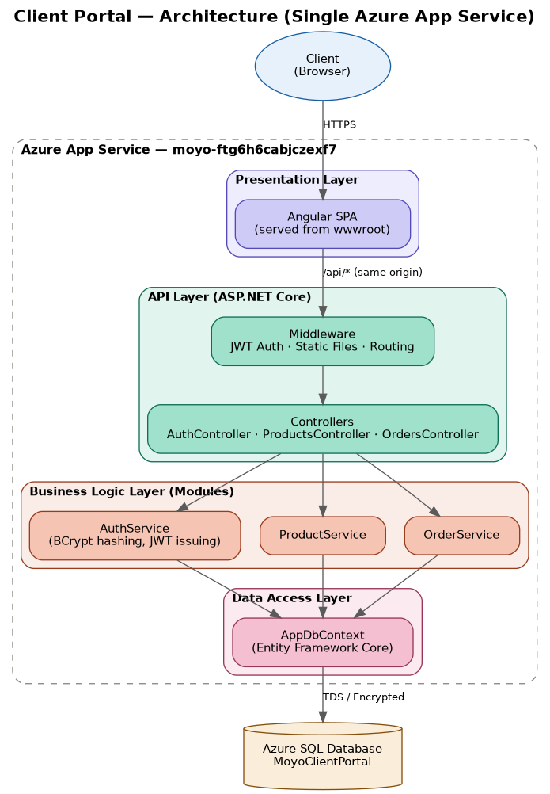
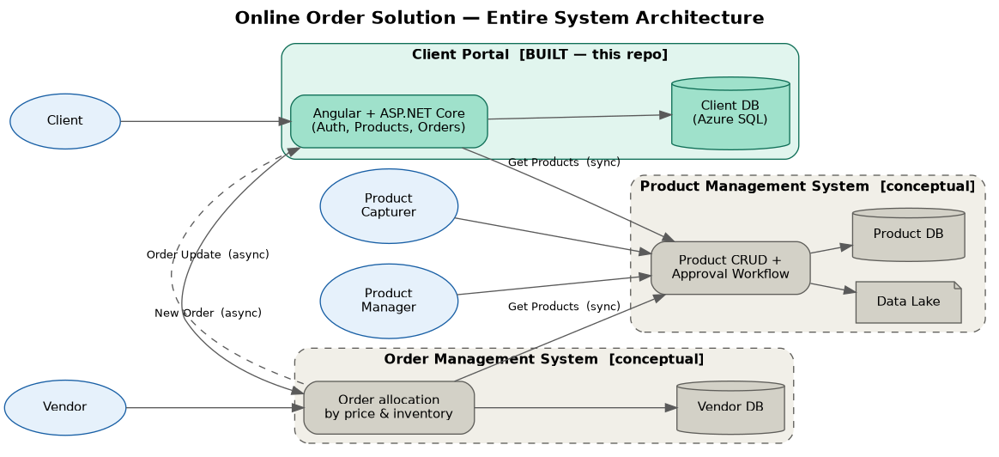
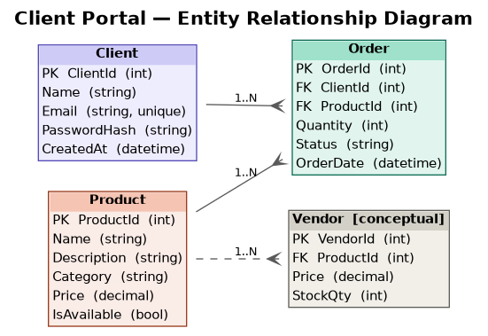

# MOYO Client Portal

### A secure client-facing portal for browsing products and placing orders

[](https://github.com/diditlaka/MOYO/actions/workflows/main_moyo.yml)

*MOYO Graduate Programme 2027 — Software Development Case Study*
**Candidate:** Mahadio Tlaka

---

## Overview

The **Client Portal** is one system within MOYO's wider Online Order Solution, a three-system case study platform (Client Portal, Order Management System, Product Management System) built for the MOYO Graduate Programme.

This repository implements the **Client Portal**: the system a client uses to register an account, log in, browse the product catalogue, and place and track their own orders. It's designed as a solid foundation that the other two systems (Order Management, Product Management) could plug into via the same asynchronous/synchronous communication patterns described in the case study brief.

## Key Features

| Feature | Description |
|---|---|
| **Client Registration & Login** | Secure account creation and authentication using JWT bearer tokens |
| **Password Security** | Passwords are hashed with BCrypt — never stored in plain text |
| **Product Browsing** | Clients can browse the available product catalogue |
| **Order Placement** | Clients can place new orders against listed products |
| **Order Tracking** | Clients can view their order history and status |
| **Single-Origin Deployment** | Frontend and backend are served from one Azure App Service — no CORS, no split hosting |

---

## Tech Stack

### Frontend


### Backend


### Database


### Cloud & DevOps


---

## Architecture

### This system — layered architecture



### The entire Online Order Solution

The case study describes three cooperating systems — Client Portal, Order Management System, and Product Management System. This repository implements the Client Portal; OMS and PMS are documented at solution/context level below to cover the "entire solution" requirement.




### Entire Solution ERD



## Project Structure

```
MOYO/
│
├── .github/
│   └── workflows/
│       └── main_moyo.yml          # CI/CD — builds Angular + .NET, deploys to Azure
│
├── database/
│   └── scripts/                   # SQL Server database scripts
│
├── src/
│   ├── web/                        # Angular front end
│   │   ├── src/
│   │   │   └── app/
│   │   │       ├── core/
│   │   │       │   ├── guards/         # Route guards (auth protection)
│   │   │       │   ├── interceptors/   # HTTP interceptors (JWT attachment)
│   │   │       │   └── services/       # API client services (auth, products, orders)
│   │   │       ├── features/
│   │   │       │   ├── auth/           # Login & registration
│   │   │       │   ├── home/
│   │   │       │   ├── products/       # Product browsing
│   │   │       │   └── orders/         # Order placement & tracking
│   │   │       └── shared/
│   │   │           ├── navbar/
│   │   │           └── sidebar/
│   │   └── proxy.conf.json         # Local dev proxy → forwards /api to the backend
│   │
│   └── backend/
│       └── Api/                    # C# .NET 10 Web API
│           ├── Controllers/
│           ├── Modules/
│           │   ├── Auth/           # Registration, login, JWT issuing
│           │   ├── Products/       # Product catalogue
│           │   └── Orders/         # Order placement & tracking
│           ├── Infrastructure/
│           │   └── Persistence/    # EF Core DbContext
│           ├── Migrations/
│           ├── wwwroot/            # Built Angular app is copied here at deploy time
│           ├── Program.cs
│           └── appsettings.json
│
├── .gitignore
└── README.md
```

---

## Running Locally

### Prerequisites
- .NET 10 SDK
- Node.js + Angular CLI
- Access to a SQL Server instance (Azure SQL or local)

### Backend
```bash
cd src/backend/Api
dotnet user-secrets init
dotnet user-secrets set "ConnectionStrings:DefaultConnection" "<your-connection-string>"
dotnet user-secrets set "Jwt:Key" "<your-jwt-key>"
dotnet run
```

### Frontend
```bash
cd src/web
npm install
ng serve --proxy-config proxy.conf.json
```

The proxy forwards any `/api/...` request from the Angular dev server to the local backend, mirroring how the two are served together in production.

---

## Security Notes

Secrets (database connection string, JWT signing key) are **not** committed to this repository. They're managed via:
- `dotnet user-secrets` for local development
- Azure App Service Application Settings for the deployed environment

If cloning this repo, set your own values using the commands above rather than editing `appsettings.json` directly.

---

*Built for the MOYO Graduate Programme 2027 — Software Development Case Study*
